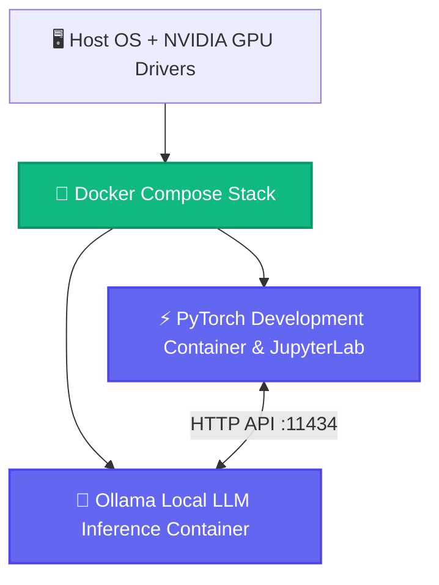

<p align="center">
  
</p>

<h1 align="center">⚡ PyTorch & Ollama GPU Deep Learning Stack</h1>

<p align="center">
  <strong>Reproducible, isolated NVIDIA GPU-accelerated Docker Compose environment combining PyTorch development with local Ollama LLM inference.</strong>
</p>

<p align="center">
  <a href="#-features">Features</a> •
  <a href="#-architecture">Architecture</a> •
  <a href="#-quick-start">Quick Start</a> •
  <a href="#-project-structure">Structure</a> •
  <a href="#-license">License</a>
</p>

<p align="center">
     
</p>

---

## ✨ Features (Key Outcomes & Capabilities)

| Icon | Feature | Outcome & Real Proof |
| :---: | :--- | :--- |
| 🚀 | **GPU-Accelerated Container Stack** | Full NVIDIA Container Toolkit pass-through for high-throughput CUDA compute |
| 🦙 | **Integrated Ollama LLM Service** | Persistent local LLM server ready to serve Llama 3, Qwen, DeepSeek, and Mistral models |
| 📓 | **JupyterLab & Python Workspace** | Pre-configured data science environment with PyTorch, Transformers, and Accelerate |
| 🛡️ | **Host-Isolated Reproducibility** | Clean architecture that prevents host environment pollution and dependency conflicts |

---

## 📊 Architecture & Flow



---

## 📁 Project Structure

```bash
python_llm/
├── 📄 docker-compose.yml      # Multi-container GPU stack definition
├── 📄 Dockerfile              # PyTorch + CUDA base image
├── 📄 Python_llm.ipynb        # Example LLM inference & fine-tuning notebook
└── 📄 README.md               # Stack documentation
```

---

## 🚀 Quick Start

### Prerequisites
- Check language runtimes (Python / Node.js) and system dependencies.

```bash
# 1. Start all GPU services
docker compose up -d

# 2. Open JupyterLab: http://localhost:8888
# 3. Pull an Ollama model:
docker compose exec ollama ollama pull llama3
```

---

## 💡 Usage Notes & Tips

> [!TIP]
> Ensure all required environment variables and dependencies are properly configured before execution.

---

<p align="center">
  Released under the <a href="LICENSE">MIT License</a>. Made with ❤️ by <a href="https://github.com/LoNebula">LoNebula</a>
</p>
