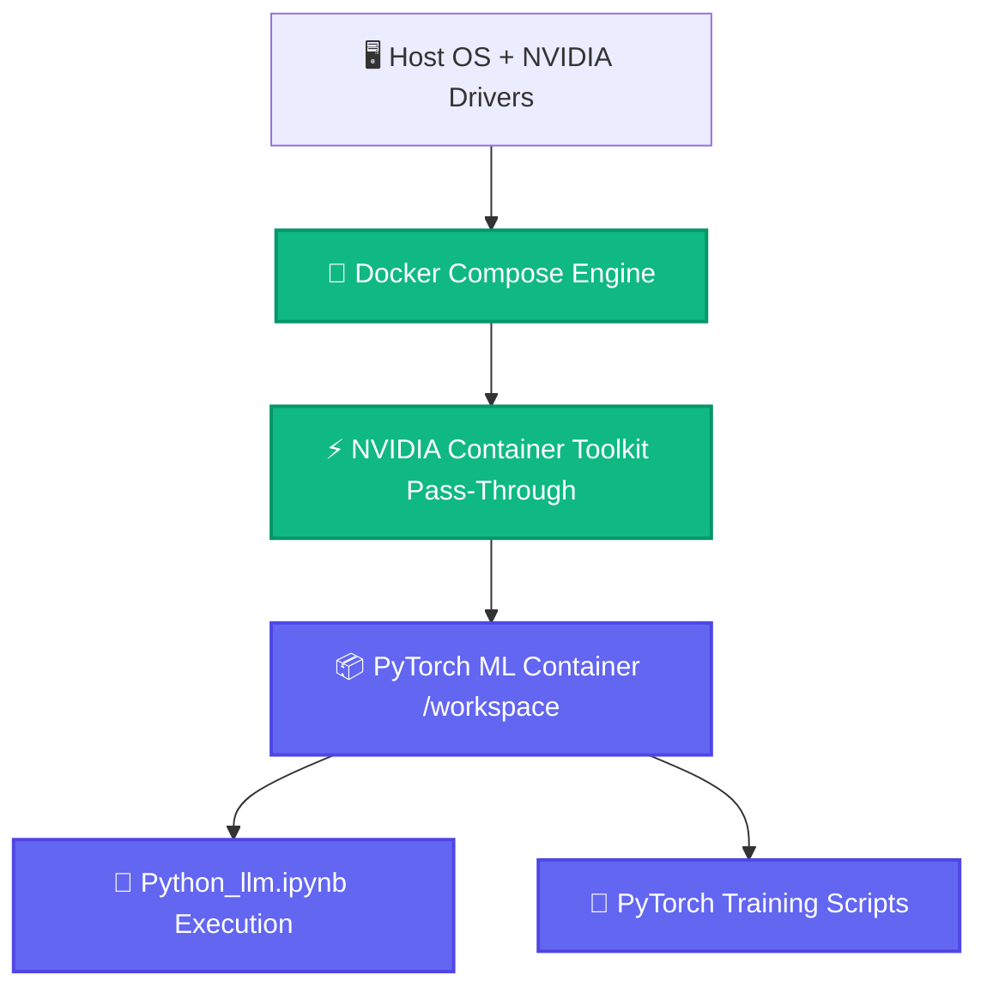

<p align="center">
  
</p>

<h1 align="center">⚡ PyTorch GPU Development Stack with Docker</h1>

<p align="center">
  <strong>Isolated, Reproducible NVIDIA GPU-Accelerated Docker Compose Development Environment for PyTorch & Machine Learning.</strong>
</p>

<p align="center">
  <a href="#-overview">Overview</a> •
  <a href="#-features">Features</a> •
  <a href="#-code-architecture">Code Architecture</a> •
  <a href="#-system-flow">System Flow</a> •
  <a href="#-project-structure">Structure</a> •
  <a href="#-quick-start">Quick Start</a> •
  <a href="#-license">License</a>
</p>

<p align="center">
     
</p>

---

## 📌 Overview

A containerized machine learning development template powered by Docker Compose and NVIDIA Container Toolkit. Provides a fully isolated PyTorch environment mapped directly to your local workspace, eliminating host dependency conflicts while providing native GPU acceleration for deep learning and LLM experimentation.

---

## ✨ Features (Key Outcomes & Capabilities)

| Icon | Feature | Outcome & Real Proof |
| :---: | :--- | :--- |
| 🚀 | **Native GPU Acceleration** | Docker Compose v2 GPU pass-through (`capabilities: [gpu]`) for high-throughput CUDA compute |
| 📁 | **Live Host Volume Mapping** | Real-time sync between host directory and container `/workspace` |
| 🛡️ | **Isolated & Reproducible** | Eliminates Python environment conflicts and host system pollution |
| 📓 | **Interactive Workspace** | Ready for interactive CLI, Jupyter, and PyTorch training scripts |

---

## 🔬 Code Architecture & Implementation

### 🔬 Code Implementation
- **`docker-compose.yml`**:
  - `build: .`: Builds from local `Dockerfile`.
  - `volumes: - .:/workspace`: Maps host directory directly into `/workspace` for real-time live synchronization.
  - `deploy.resources.reservations.devices`: Configures `driver: nvidia`, `count: all`, `capabilities: [gpu]` for full GPU hardware pass-through.
  - `stdin_open: true`, `tty: true`: Enables interactive terminal (`docker compose exec`) and REPL sessions.
- **`Python_llm.ipynb`**: Machine learning and PyTorch GPU verification notebook.

---

## 📊 System Flow



---

## 📁 Project Structure

```bash
python_llm/
├── 📁 assets/                 # High-resolution SVG banners
│   └── 🎨 hero.svg
├── 📄 docker-compose.yml      # NVIDIA GPU container stack definition
├── 📄 Dockerfile              # PyTorch + CUDA base image
├── 📄 Python_llm.ipynb        # GPU verification & ML experimentation notebook
└── 📄 README.md               # Documentation
```

---

## 🚀 Quick Start

```bash
# 1. Build and start GPU container in background
docker compose up -d

# 2. Access interactive bash inside GPU container
docker compose exec app bash

# 3. Verify PyTorch GPU acceleration
python -c "import torch; print('CUDA Available:', torch.cuda.is_available(), '| Device:', torch.cuda.get_device_name(0))" 
```

---

<p align="center">
  Released under the <a href="LICENSE">MIT License</a>. Crafted with precision by <a href="https://github.com/LoNebula">LoNebula</a>
</p>
